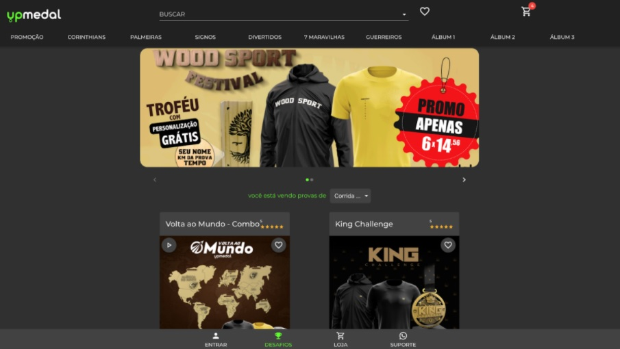

# Ecommerce UPMedal
Desafio #3 - Criar a solução a partir de um boiler template padrão da Vtex IO

 

Layout proposto:

Layout final:

## Desktop

Para esta tela utilizar os componentes:

- [ ] Flex Layout para criar as cores em css - https://vtex.io/docs/components/all/vtex.flex-layout@0.17.0/
- [ ] Dar prioridade as páginas criadas nos arquivos .jsonc colocando comentários dos blocos criados
- [ ] Criar um componente Tab Layout para separar os produtos por categoria - https://vtex.io/docs/components/all/vtex.tab-layout@0.4.3/
- [ ] Utilizar o Slider layout para mostrar os produtos em destaque - https://vtex.io/docs/app/vtex.slider-layout
- [ ] Criar um bloco de lista de produtos - https://vtex.io/docs/app/vtex.product-list@0.31.0/ - Sugestão paginado por 8 itens da categoria
- [ ] Criar Minicard para lista dos produtos no carrinho - https://vtex.io/docs/components/content-blocks/vtex.minicart@2.60.0/
- [ ] Ao clicar no produto ir para tela com Product Summary - https://vtex.io/docs/components/all/vtex.product-summary@2.53.0/

## Mobile

- [ ] Criar um componente customizado para falar com suporte no whatsapp, no rodapé
- [ ] Utilizar o Vtex Componentes com React para criar o componente - https://vtex.io/docs/components/all/vtex.store-components@3.150.0/
- [ ] API whatsapp - https://www.convertte.com.br/gerador-link-whatsapp/
- [ ] Criar um componente customizado para cadastrar leads (possíveis clientes prospectos)
    - Nome
    - Email
    - Telefone
- [ ] Este componente pode servir de isca digital, fazendo dando uma bonificação para o prospecto que preencher as informações da lead.
- [ ] Utilizar o Vtex Componentes com React para criar o componente - https://vtex.io/docs/components/all/vtex.store-components@3.150.0/
- [ ] Mais sugestões para ajudar no layout:
    - https://vtex.io/docs/getting-started/desenvolva-componentes-usando-vtex-io-e-react/5/
    - https://vtex.io/docs/components/all/vtex.stack-layout@0.1.0/

## AWS API Gateway

- [ ] Com o objetivo de armazenar as leads que o Vtex componente irá utilizar no React, criar uma API Gateway na AWS para colocar as informações - https://aws.amazon.com/pt/api-gateway/
- [ ] Um exemplo de arquivo API Gateway para estudo:
    - https://github.com/awslabs/aws-api-gateway-developer-portal/blob/master/cloudformation/template.yaml
    - https://github.com/mattpodolak/email-api-lambda
    - https://github.com/amazon-archives/realworld-serverless-application/blob/master/backend/sam/app/api.template.yaml

## Opcional

- [ ] Criar um item no adm do vtex para trazer o conteúdo das leads cadastradas na API Gateway AWS
